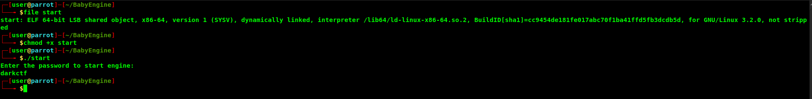
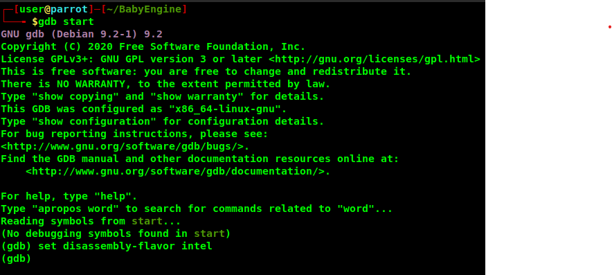
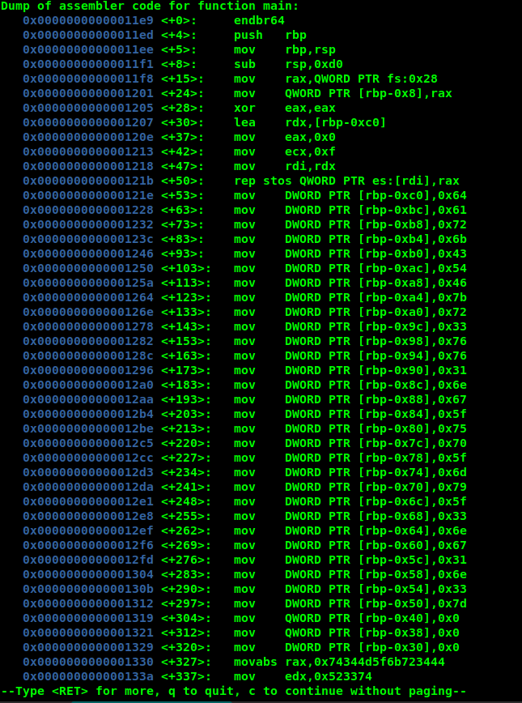
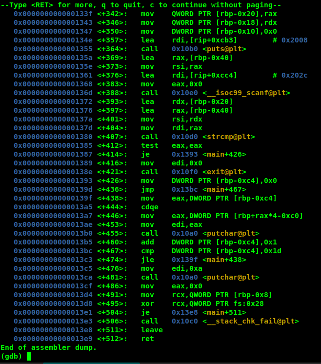
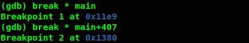
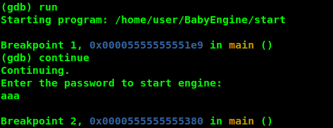
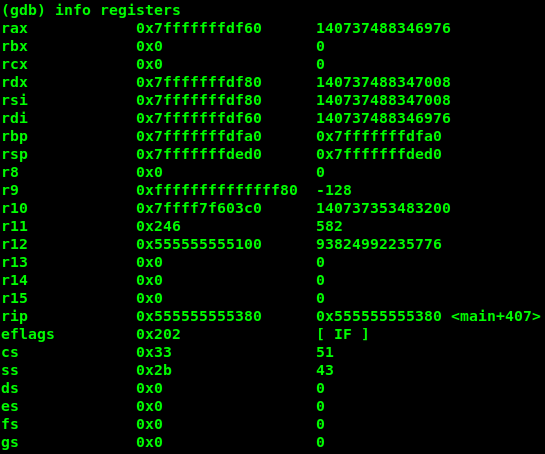
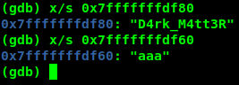

# Baby Engine
## Rev

### description:
```
I think I forgot my key.
Could you help me start my engine?
```

### Note:
I have been struggling to learn reversing functions and always found it hard. so here is my attempt at making a writeup as easy as possible for my rev challenge BabyEngine.  
I might be wrong with terminologies as I only started learning and researching about reversing very recently.  
Feel free to criticize me and let me know if there are any big mistakes I have made. THANKS A TON!  


### Solution:  
Let's look at what file was given to us:  
```
$ file start
start: ELF 64-bit LSB shared object, x86-64, version 1 (SYSV), dynamically linked, interpreter /lib64/ld-linux-x86-64.so.2, BuildID[sha1]=cb1454de181asd17abc70j54a41ffd5faj7cdb5d, for GNU/Linux 3.2.0, not stripped
```

and so it is an ELF Linux executable file  
But executing it, it asks us for a password.  
  
Let's disassemble the file with `gdb` (GNU debugger)  

Before I proceed with that, I prefer assembly lang syntax in intel and not in At&T (which is the default syntax in vanilla gdb). To do that use command `set disassembly-flavor intel`:  
  

now let's disassemble the main function with the command `disassemble main`:  
(Note this is only the first half of the disassembled function)  
  
Now for beginners in rev this might look like just tons of randomness but it is really simple! Lets try to understand what is going on here.  
the disassembled dump seems to have 3 columns: the first:  
```
memory address
```
the second:  
```
action performed at the corresponding address
```
and the third:  
```
the registers involved  
```

we can see that from main+53 (the address 0x000000000000121e <+53> for convenience I will refer to them as main + offset_with_respect_to_main, here 53) there is some kind of assignment going on.  
for example at main+53 `DWORD PTR [rbp-0xc0], 0x64`. here DWORD PTR is a keyword corresponding to a size of 4 bytes to the register rbp  
the phrase `0xc0` following rbp is in hex and in the decimal equivalent is `192`.  
from main+53 to main+297 we can see that the hex number at N in the expression `DWORD PTR [rbp-N]` (or in other words right after `rbp-`) at every line has a difference of 4 with the next and previous line.  
So this relates to an array/list of numbers.  
let's call rbp as a list N for now.  
at main+53 `DWORD PTR [rbp-0xc0], 0x64` basically means `N[0] = 100` (now again `0x64` is hex with its corresponding decimal being `100`)  
and `100` ascii number gives `d` ascii text  
You already know where this is going...  
get all the hex numbers at the end of each line from main+53 up to main+297, and convert them from hex numbers to text and VOILA! there's your flag!  


now if you want to crack the executable file to get the flag too for the purpose of learning I'll do my best explaining that part too  
  

This here is the second half of the disassembled main dumped.  
I cannot explain all the process going on here but I'll try my best to explain the general stuff going on here.  
at main+364 the function puts is called which output's the text asking you to enter a password.  
at main+388 your response is recorded with the C std lib function scanf().  
at main+407 your response is compared with the stored password.  

the next part if your response matches then it loops through the list of numbers and gives the flag, else it exits.  
We need main+407 where our response is compared with the stored password.  
We need to add breakpoints at main and at the address where our response and password was being compared.  
let's add a break point at main and at main+407 like this:  
  
Now let's run the program within gdb. When you run with the command `run` it stops at the first breakpoint that is at the very start (breakpoint 1).  
enter the command `continue` to run the program until the next breakpoint, which we have set at main+407 (breakpoint 2).  
When you enter continue the gdb debugger asks for an input. this is the same input that the program `start` is asking for.  
You can enter any random input. It does not matter. I have provided `aaa` as our input.  
  
Looking at 2 lines before main+407 we can see that the registers rdi and rsi have been called to. So the values stored in the 2 registers are being compared.  
let's now dump the information on all the registers at this point, with the command `info registers`.  
  
the registers `rsi` and `rdi` seem to have something stored in them because the second column for the 2 registers is filled with some hex value. Let's see what those values are:  
The value stored in `rdi` is your input.  
While the value stored in `rsi` is the PASSWORD!!!  
The command to do this is `x/s <the hex values>`  
  

And thus we got the key: `D4rk_M4tt3R`  
Now close gdb by entering `q` and run the `start` program:  
  

### Flag:
> darkCTF{r3vv1ng_up_my_3ng1n3}
