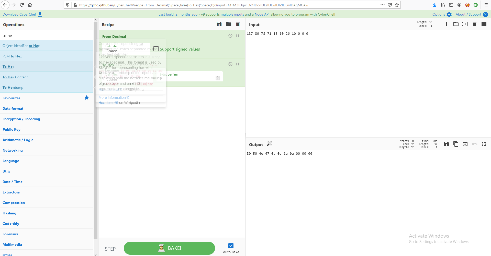

# BitByBit
## Misc

### Description:
```
baby ko BASE pasand hai!
Translation: Baby loves BASE!
```

### Solution:
So Connecting to the netcat command it asks us to decode a bse64 encoded string.
and answering right gives us an array of bits.
there are a total of 175 questions. And a total of 7525 bits given to you.
converting the intitial numbers given on [CyberChef](https://gchq.github.io/CyberChef/) and converting them to hex reveals that they are magic bytes of a png


This challenge can be completed with this script.
By the end of the script you should see a flag.png in the same directory with your flag.

##### Script:
```
from pwn import *
from base64 import b64decode
from binascii import unhexlify

r = remote('bitbybit.darkarmy.xyz', 7001)
img = b''


print(r.recvline().decode('utf-8'),end='')
for i in range(175):
    base = r.recvline().decode('utf-8').split()[-1]
    r.recvuntil(b'> ')
    ascii = (b64decode(base.encode()))
    r.sendline(ascii)
    print(base)
    print(ascii)
    img += b''.join(y for y in [ unhexlify(hex(int(x))[2:].zfill(2)) for x in r.recvline().decode('utf-8').replace('[', '').replace(']', '').split(', ') ] )

r.close()
with open('flag.png', 'wb') as image:
    image.write(img)
```

### Flag:
> darkCTF{sl0wLy_bu7_&ur3ly}
