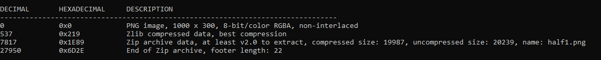
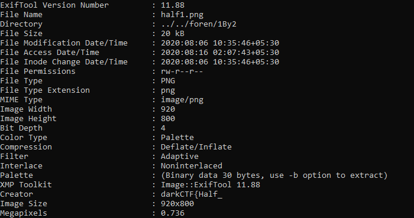

# 1/2
## Forensics

### Description:
```
1 / 2
walking over the bins...
meta meta meta...
```

### Solution:
Downloading and lookin at the image given with the challenge:

we get the only a part of the flag. We have to find the first part.
> 4nd_h4Lf}

For this, the description gives you a clue on what steps to take to get the other half of the flag.
The second line of the description says:
```
walking over the bins...
```

This is a hint to use to tool binwalk on the image given to you with the challenge.
you can scan for hidden file signatures in an image with:
```
binwalk <path to file>
```


...And to extract all the files that binwalk recognises we can use the following binwalk command:
```
binwalk -e <path to file>
```
There is a hidden zip file in this image. unzipping it's contents gives us another image.
But this image has no flag :(

To get the flag from the new image, let's look at the second line of the description:
```
meta meta meta...
```
Thus, let's look at the meta data of the new image. This can be done with with the tool `exiftool`
(You might have to download or install the tool with `sudo apt install exiftool`)
The `Creator` of the image definitely looks weird.

> darkCTF{Half_

### Flag:
> darkCTF{Half_4nd_h4Lf}
