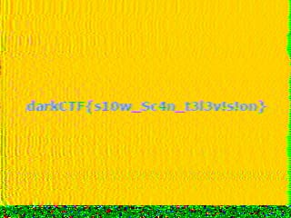

# SS
##  Forensics

### Description:
```
beep beep
doot doot
```

### Solution:
The name of the challenge is a hint. The type of encoding used here is SSTV or Slow Scan Television encoding.
record the given wave file with any robot36 decoder and you will get your flag as an image.
I have used Robot36 app, available on android.


### Flag:
> darkCTF{s10w_Sc4n_t3l3v!s!on}
