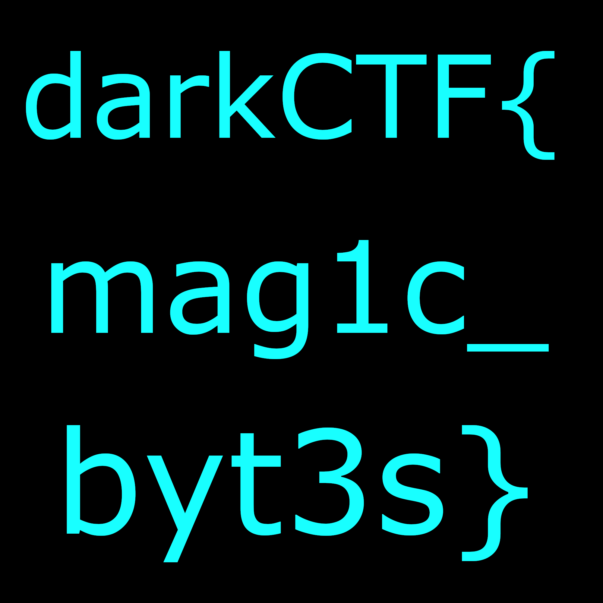

# QuicFix
## Misc
### flabby

### Description:
```

```

### Solution:
The solution involves 2 parts:  
##### Part1:
Unzipping the attached file gives us 10,000 corrupted files.  
each named as `flag_1_j.jpg`.  

Looking at the first file we see that there is a IHDR chunk in a jpg file, which is why it is corrupted.  
The image's data is that of a png but, the png header was replaced with jpg header, so was the file extension.  
This can't be done manually, obviously. This can be automated with python.  
##### Sample Script:
```python
from binascii import unhexlify

def fixIt(i,j):
    src = f"flags/flag_{i}_{j}.jpg"
    dest = f"fixed/flag_{i}_{j}.png"

    file = open(src, "rb")
    data = file.read()
    file.close()

    png_header_int = ['89', '50', '4e', '47', '0d', '0a', '1a', '0a']
    png_header = b''.join(unhexlify(i) for i in png_header_int)
    fixed = png_header + data[10:]

    file = open(dest, "wb")
    file.write(fixed)
    file.close()

for i in range(100):
    for j in range(100):
        fixIt(i, j)
```

The script requires the challenge files (namely flag_i_j.jpg) to be saved in a folder called `flags`.  
Once the script is executed, all the fixed files will be saved in another directory called `fixed`.  


##### Part2:
Looking at the fixed files along with their name one might be able to tell that these are all part of a whole image.  
These smaller images have to be fixed together like a jigsaw puzzle.  
Again, making use of python's Pillow module, this can be automated:  

##### Sample Script:
```python
from PIL import Image

def join():
    dest = "flag.png"

    pixels = []
    for j in range(100):
        p1 = []
        p2 = []
        p3 = []
        p4 = []
        p5 = []
        p6 = []
        p7 = []
        p8 = []
        p9 = []
        p10 = []
        p11 = []
        p12 = []
        p13 = []
        p14 = []
        p15 = []
        p16 = []
        p17 = []
        p18 = []
        p19 = []
        p20 = []
        for i in range(100):
            src = f"fixed/flag_{i}_{j}.png"
            img = Image.open(src, "r")
            ps = list(img.getdata())

            p1 += ps[0:20]
            p2 += ps[20:40]
            p3 += ps[40:60]
            p4 += ps[60:80]
            p5 += ps[80:100]
            p6 += ps[100:120]
            p7 += ps[120:140]
            p8 += ps[140:160]
            p9 += ps[160:180]
            p10+= ps[180:200]
            p11+= ps[200:220]
            p12+= ps[220:240]
            p13+= ps[240:260]
            p14+= ps[260:280]
            p15+= ps[280:300]
            p16+= ps[300:320]
            p17+= ps[320:340]
            p18+= ps[340:360]
            p19+= ps[360:380]
            p20+= ps[380:]

        pixels += p1+p2+p3+p4+p5+p6+p7+p8+p9+p10+p11+p12+p13+p14+p15+p16+p17+p18+p19+p20
    print(len(pixels))
    img2 = Image.new("RGBA", (2000,2000))
    img2.putdata(pixels)
    img2.save(dest)


def main():
    img = Image.open("fixed/flag_0_0.png")
    pixels = list(img.getdata())
    print(pixels)
    print(len(pixels))

#main()
join()
```

The script requires the fixed files to be stored in the directory `fixed` in the script's directory (as it was earlier).  
Once executed, there should be a flag.png in the current directory.


### Flag:
> darkCTF{mag1c_byt3s}
