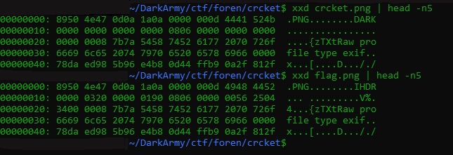

# CRCKET
## Forensics
### Authors: flabby, echobash

### Description:
```
DarkArmy's openers bagging as many runs as possible for our team.
    1st over: 86 runs
    2nd over: 37 runs
    3rd over: 4 runs
    4th over: 52 runs
```

### Solution:
replace DARK with IHDR, IDAT header.  
convert the values in the description to hex and replace `00 00 00 00` crc value in IHDR chunk  
with the hex values you get from the hex values.  

You cab use the following sample script to get the hight and width of the image from crc chunk:  
```python
from binascii import crc32

correct_crc = int.from_bytes(b'\xe3\x67\x7e\xc0',byteorder='big')

for h in range(2000):
    for w in range(2000):
        crc=b"<enter_crc_hex>"+w.to_bytes(4,byteorder='big')+h.to_bytes(4,byteorder='big')+b"\x08\x06\x00\x00\x00"
        if crc32(crc) % (1<<32) == correct_crc:
            print ('FOUND!')
            print ('Width: ',end="")
            print (w)
            print ('Height :',end="")
            print (h)
            exit()
```

Replace hex values of width and hight in IHDR chunk data.  
this should give you the flag  

The initial few bits shouldlook something like this:  


The first dump in the image is that of the challenge png given.  
And the second is the dump of the fixed png.  

### Flag:
> darkCTF{cycl1c_r3dund4ncy_ch3ck}
